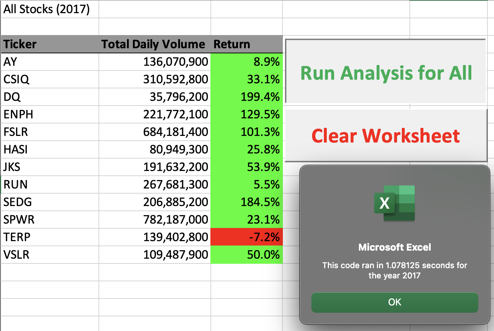
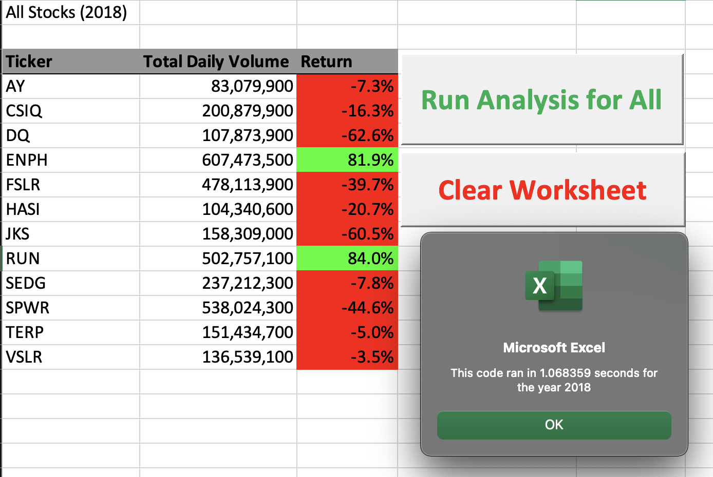

# **Green Stocks with the Best Return Value**

## This analysis report is to find which green stocks hold the most value per year by using a refactored script.

### Main Analysis:
   I had to build a VBA code to quickly and efficiently show which stocks have the best return per year. This code was able to not only make this data easier to read, but is designed for fast analysis in the future. By running our new script, We can now easily come to a few conclusions based on these images.

### All Stocks (2017)

### All Stocks (2018)

## Results:
   As we can see, 2017 was mostly a profitable year. Because of the code that was written, we were also able to quickly assess the following year. 2018 was mostly at a loss exept for two stocks, ENPH and RUN, both of which also made a profit the previous year. This script is light, efficient, and easy to use with big, accessible buttons ready to generate upcoming years data into an easy-to-read format.

## Summary regarding the VBA script: 
   Building a specific script like this and refactoring has its pro's and con's:
   
   ### PRO: 
    - The script runs faster and lighter when refactored. 
    
    - It is a lot easier to read and fix when shortened.

   
   ### CON: 
 
    - You might run into problems during the testing stage by accidently removing something you need.

    - The possibility of accidently copy/pasting redundant code in the future.

    - Taking additional time to refine a working code might conflit with time sensitive deadlines.
   
 Saving, refactoring the original VBA code, splitting up, and labling its funtions will benifit you and whomever wants to use the code you built in the future. In our case for this analysis, shortening the code caused the code to run slightly faster. Unfortunately, while I was refining the original VBA code, I had typed the tickerStarting and tickerEnding in the wrong order, which gave me the wrong results, dispite the code running without errors. Even with the time lost, refining the original code will hopefully make up time lost in the future with its simplicity, and speed.
